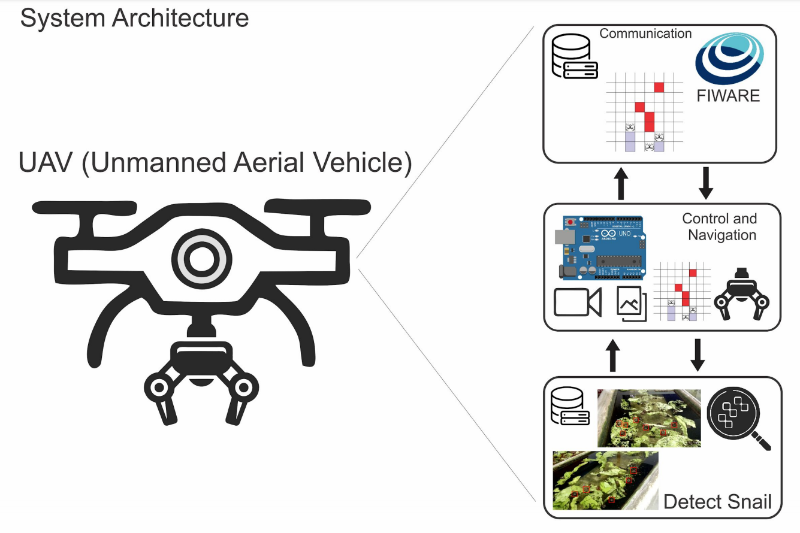
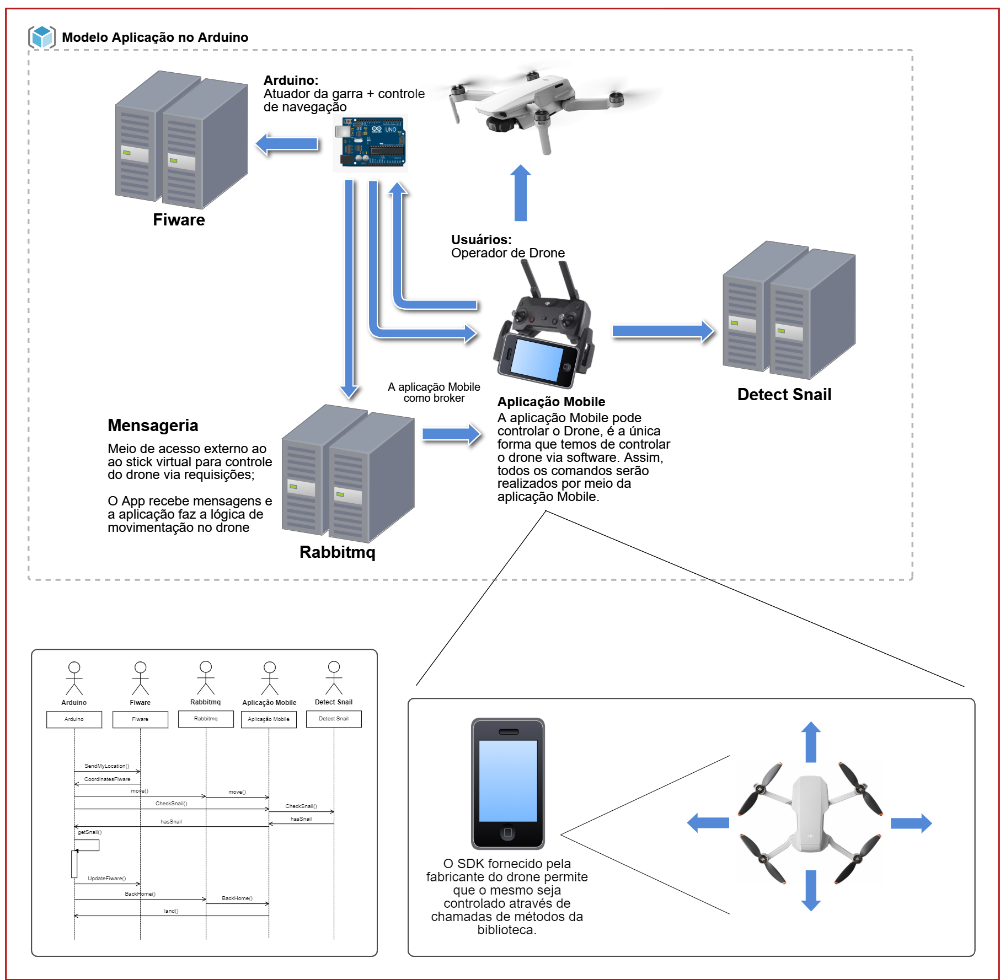

# HealthDrones DetectSnail

Description: The use of satellite data can be complemented by collected one by devices in flight, "drones". This provides a platform of data very close to reality and can be programmable by IOT (Internet Of Things) applications. These data can be used for monitoring environments at risk or under specific control (epidemiological or any crowd phenomena). This project will provide an overview of the software platforms available today for development of algorithms for unmanned aerial vehicles (UAVs) in autonomous flight to be used in IOT applications. We are primarily interested in their use for epidemiological monitoring of areas under risk, but these platforms can be used to monitor any kind of crowd event. In particular, in this project, images are captured and processed using NOAA and Meteosat 8 Satellites. They are operated by GOESERE-UFRPE (Laboratory of GIS and Remote Sensing of the Federal Rural University of Pernambuco) - http://www.dtr.ufrpe.br/geosere/ - and are used to compose the monitoring scenarios. Images and other data are also captured and processed by the drones platforms and its sensors. This information will compound automatic surveillance scenarios of the phenomena. The development of a prototype for Schistosomiasis will provide an evaluation of the platforms used for this project. In this way, as the main outcome, this project will provide an overview of technologies available today, their ability to integrate with legacy systems and their programming capabilities. The importance of this project for the industry takes on the aspect of evaluation of commercial platforms for UAVs to be a possible IDE for software applications in industry. This project is a coordinate action by researchers from CIN-UFPE, INES, LIKA and HEALTHDRONES.

